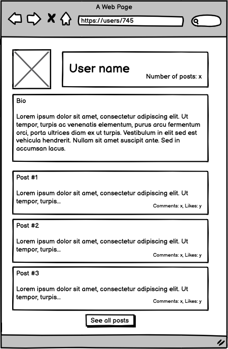

# 📗 Table of Contents

- [📗 Table of Contents](#-table-of-contents)
- [📖 Blog app ](#-blog-app-)
  - [🛠 Built With ](#-built-with-)
    - [Tech Stack ](#tech-stack-)
    - [Key Features ](#key-features-)
  - [💻 Getting Started ](#-getting-started-)
    - [Prerequisites](#prerequisites)
    - [Setup](#setup)
    - [Run](#run)
    - [Test](#test)
  - [👥 Authors ](#-authors-)
  - [🔭 Future Features ](#-future-features-)
  - [🤝 Contributing ](#-contributing-)
  - [⭐️ Show your support ](#️-show-your-support-)
  - [🙏 Acknowledgments ](#-acknowledgments-)
  - [📝 License ](#-license-)

# 📖 Blog app 

**Blog app** will be a classic example of a blog website. I will create a fully functional website that will show the list of posts and empower readers to interact with them by adding comments and liking posts. Everything will be based on the given UML class diagram. The data will be stored in postgreSQL database. 

The project is divided in eleven (11) milestones and one exercise.

- Milestone 1: Setup and controllers
- Milestone 2: Controllers specs
- Milestone 3: Creating a data model
- Milestone 4: Processing data in models
- Milestone 5: Views
- Milestone 6: Forms
- Milestone 7: Validations, Model specs, and n+1 problems
- Milestone 8: Add Devise
- Milestone 9: Add authorization rules
- Milestone 10: Integration specs for views
- Milestone 11: Add API endpoints
- Exercise: API documentation
  
The app is built to match the following Entity Relationship Diagram:

This project is designed following these wireframes:

{ width=100px }{ width=100px }{ width=100px }{ width=100px }{ width=100px }

## 🛠 Built With 

### Tech Stack 

<ul>
    <li><a href="https://www.ruby-lang.org/en/">Ruby</a></li>
    <li><a href="https://www.rubyonrails.org/">Ruby on Rails</a></li>
    <li><a href="https://www.postgresql.org/">PostgreSQL</a></li>
</ul>

### Key Features 

- Create a post
- List all posts by users
- Post details
- User details
- Like posts
- Comment posts

(<a href="#readme-top">back to top</a>)

## 💻 Getting Started 

### Prerequisites

  * Make sure you have Ruby installed in your system. You can install it [here](https://www.ruby-lang.org/en/documentation/installation/)

  * Get started with [Ruby on Rails](https://guides.rubyonrails.org/getting_started.html).

  * Make sure you have [PostgreSQL](https://www.postgresql.org/) installed and running.

### Setup

  * Clone this repository by running `git clone https://github.com/developertariq/my-blog` in your command line.

  * Navigate to the repository by running `cd my-blog`.

  * Run `bundle install` to install all the gems.
### Run
  *  Change/include `host, username, password` according to your database server.
  *  Run `rails db:create` and `rails db:migrate`
  *  Run `rails db:seed` to populate the database with some sample data.
  *  Run `rails s` to start the server.
  *  In your browser, go to `http://localhost:3000`.

### Test

  * Run `gem install rspec` to install Rspec,
  * Run `rspec spec` to run all the test cases, and
  * Run `rspec spec/name_of_test_file.rb` to run test cases individually.

(<a href="#readme-top">back to top</a>)

## 👥 Authors 

👤 **Md Tariq-ul Islam**

- GitHub: [@developertariq](https://github.com/developertariq)
- Twitter: [@developer-tariq](https://twitter.com/developer_tariq)
- LinkedIn: [@developer_tariq](https://www.linkedin.com/in/developer-tariq/)

(<a href="#readme-top">back to top</a>)

## 🔭 Future Features 

- [ ] **Optimized Database**
- [ ] **Better UI Experience**

(<a href="#readme-top">back to top</a>)

## 🤠Contributing 

Contributions, issues, and feature requests are welcome!

Feel free to check the [issues page](../../issues/).

(<a href="#readme-top">back to top</a>)

## ⭐️ Show your support 

If you like this project, please consider giving it a star.

(<a href="#readme-top">back to top</a>)

## 🙠Acknowledgments 

- I would like to thank all code reviewers for making this project better.

(<a href="#readme-top">back to top</a>)

## 📠License 

This project is [MIT](./LICENSE/MIT.md) licensed.

(<a href="#readme-top">back to top</a>)

